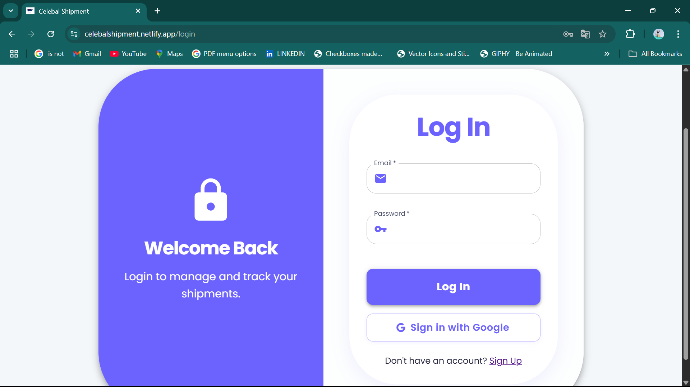
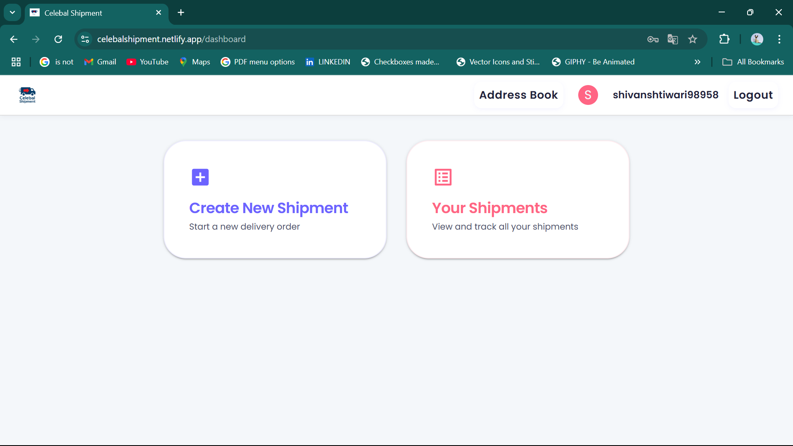
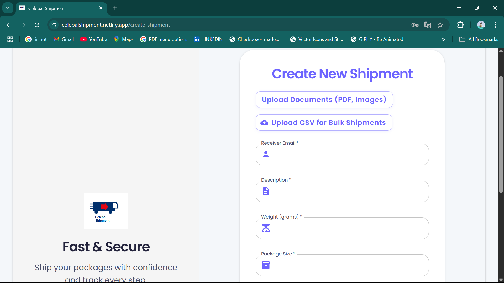
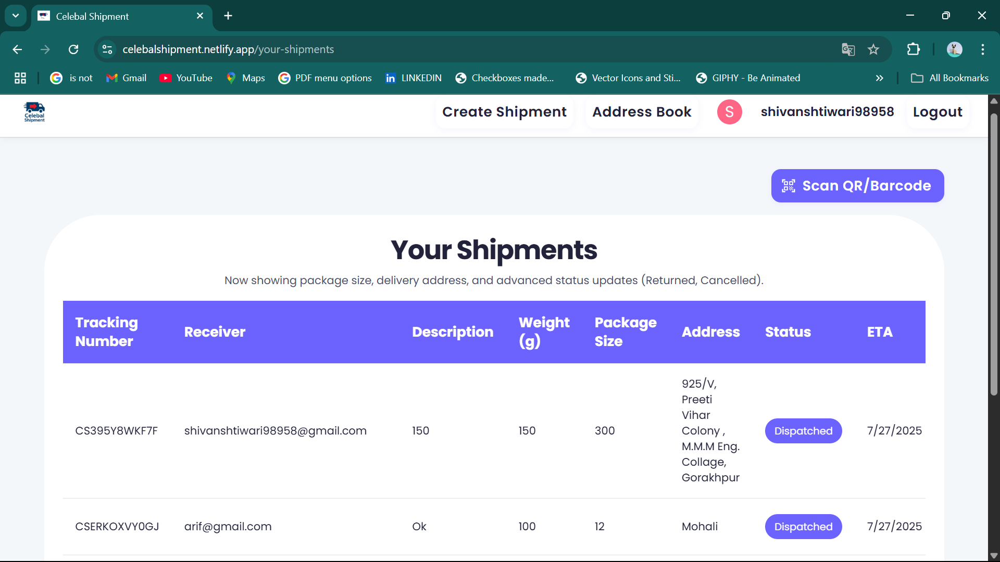
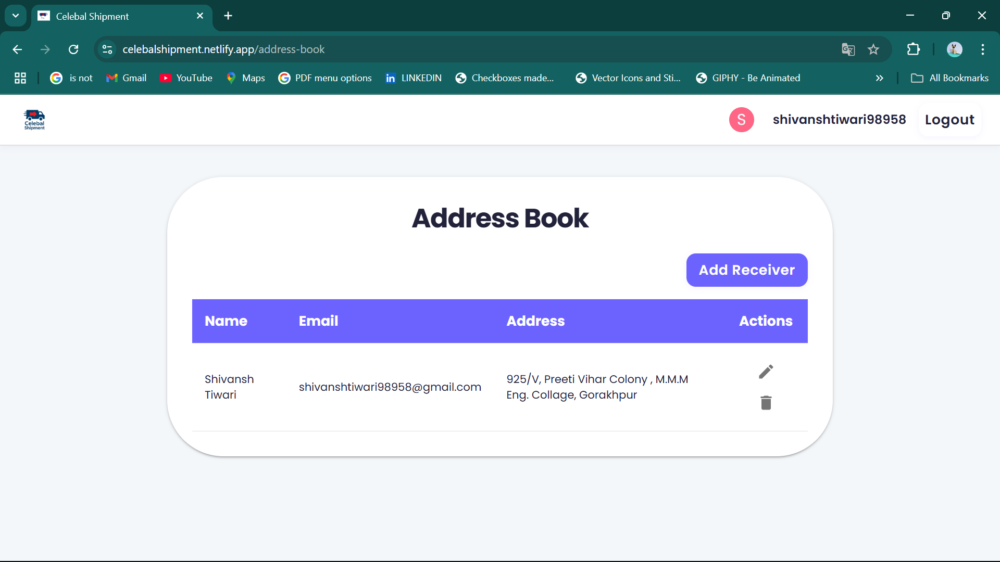

# Shipment Delivery Application


---

## Project Overview
This Shipment Delivery Application was developed as a final project during the Celebal Technologies Summer Internship 2025 (CSI'25) program. It is designed to streamline the process of creating, tracking, and managing shipments, offering a seamless experience for users, administrators, and delivery agents.

### Key Features
- **User Authentication:** Secure sign-up and login.
- **Shipment Management:** Create, track, and manage shipments with dynamic charge calculation and bulk upload options.
- **Real-time Tracking & Updates:** Comprehensive status updates (Dispatched, In Transit, Delivered, Returned, Cancelled) with full history tracking.
- **Role-Based Panels:** Dedicated interfaces for Admins and Delivery Agents.
- **Address Book:** Efficient management of frequently used addresses.
- **Notifications:** Real-time alerts for critical actions and status changes.
- **Document Upload:** Attach PDFs or images for verification.
- **Modern UI:** Built with React and Material UI for a responsive and intuitive user experience.

---

## Screenshots

### Login Page


### Dashboard


### Create Shipment


### Your Shipments


### Address Book


> _**Note:** Ensure these screenshot images are present in the `src/assets/` directory for proper display._

---

## Tech Stack
- **Frontend:** React, Vite, Material UI
- **Backend:** Firebase (Authentication, Firestore, Storage)
- **Payments:** Razorpay Integration
- **Deployment:** Netlify

---

## Getting Started

### Prerequisites
- Node.js (v16 or above)
- npm or yarn

### Installation
```bash
# Clone the repository
git clone <your-repo-url>
cd Shipment-Delivery-Application

# Install dependencies
npm install
# or
yarn install

# Start the development server
npm run dev
# or
yarn dev
```

### Environment Variables
Create a `.env` file in the root directory and configure your Firebase and Razorpay credentials. Refer to `src/firebase.js` and `.env.example` for details.

---

