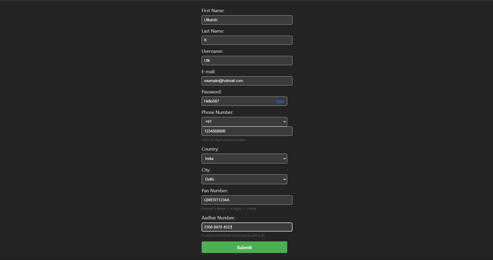
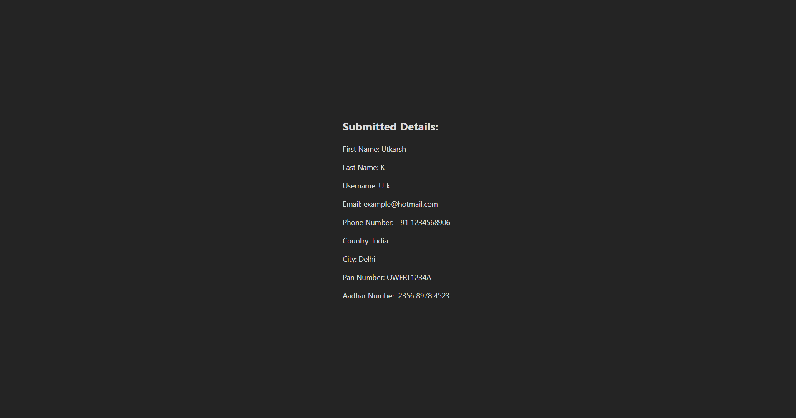

# React + Vite

This project is a simple React application built with Vite. It features a user registration form and a details display page.

## Features

- User registration form with validation for fields like email, phone, PAN, and Aadhar.
- Country and city selection with dynamic options.
- Password visibility toggle.
- On successful submission, user details are displayed on a separate page.

## Pages & Screenshots

### 1. Form Page

This page allows users to enter their details and submit the form.



### 2. Details Page

After submitting the form, the entered details are shown here.



> **Note:**
>
> - To add your screenshots, take a screenshot of each page and save them as `form-page.png` and `details-page.png` in the `public` folder of your project.
> - The images will then appear above.

## Getting Started

1. Install dependencies:
   ```sh
   npm install
   ```
2. Start the development server:
   ```sh
   npm run dev
   ```
3. Open your browser at the provided local address to view the app.

## Expanding the ESLint configuration

If you are developing a production application, we recommend using TypeScript with type-aware lint rules enabled. Check out the [TS template](https://github.com/vitejs/vite/tree/main/packages/create-vite/template-react-ts) for information on how to integrate TypeScript and [`typescript-eslint`](https://typescript-eslint.io) in your project.
