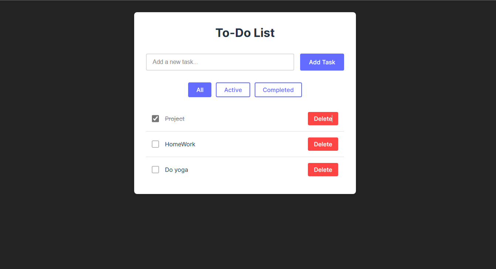

# React Todo List Application

A modern, feature-rich Todo List application built with React and Vite.

## Project Screenshot


## Features

- Add, remove, and mark tasks as completed
- Input validation for new tasks
- Filter tasks by status (All, Active, Completed)
- Automatic sorting of tasks by creation date
- Local storage persistence
- Responsive design
- Keyboard accessibility

## Getting Started

1. Clone the repository
2. Install dependencies:
   ```bash
   npm install
   ```
3. Run the development server:
   ```bash
   npm run dev
   ```

## Testing Guide

### Manual Testing

1. **Task Addition**
   - Try adding a task with empty input (should not add)
   - Add a task with valid input
   - Verify the task appears at the top of the list
   - Check if the input field clears after adding

2. **Task Completion**
   - Click the checkbox next to a task
   - Verify the task appearance changes (strikethrough)
   - Toggle the completion status multiple times

3. **Task Deletion**
   - Add multiple tasks
   - Delete a task from the middle of the list
   - Verify the correct task was removed
   - Check if other tasks remain unchanged

4. **Filters**
   - Add both completed and incomplete tasks
   - Test each filter (All, Active, Completed)
   - Verify the correct tasks are shown for each filter
   - Switch between filters multiple times

5. **Persistence**
   - Add several tasks
   - Refresh the page
   - Verify all tasks and their states are preserved

### Unit Testing Suggestions

Consider adding the following test cases using a testing framework like Jest and React Testing Library:

1. **Component Rendering**
   ```javascript
   test('renders TodoList component')
   test('renders empty state correctly')
   ```

2. **Task Management**
   ```javascript
   test('adds a new task')
   test('prevents adding empty tasks')
   test('toggles task completion')
   test('deletes a task')
   ```

3. **Filtering**
   ```javascript
   test('filters active tasks')
   test('filters completed tasks')
   test('shows all tasks')
   ```

4. **Local Storage**
   ```javascript
   test('saves tasks to localStorage')
   test('loads tasks from localStorage')
   ```

## Contributing

Feel free to submit issues and enhancement requests!
